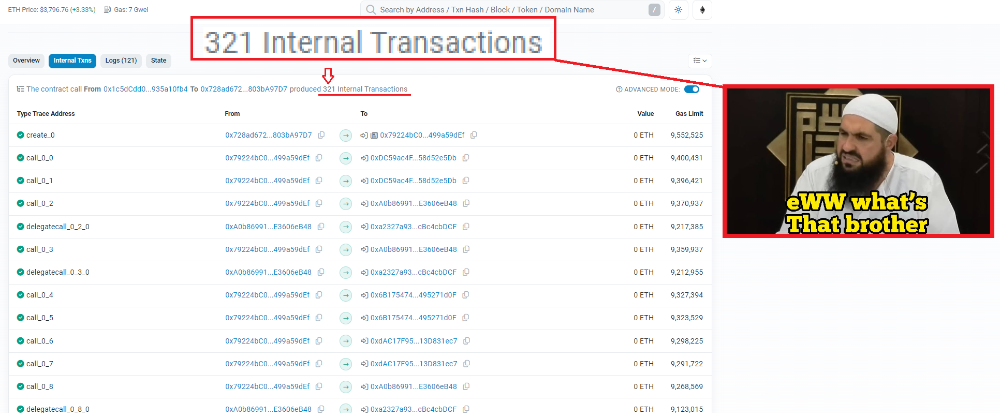

# Why is Trace data parsing so bad?
## The current state of Traces

  #TraceUI

Ethereum *Traces*, what do they mean? To 99.99% of people, absolutely nothing, to active users of the Ethereum Blockchain? 99.98%. Its clear only blockchain nerds care to examine trace data, ...right?, How else is one to explain [EtherscanUI](../resources/img/WhatsThatBrother.png) - the most popular indexer of Ethereum Data. The legibility is lacking in almost every tangible metric, the interactions are call codes, the *from* and *to* address tell us nothing about the nature in which these interactions take place nor the contracts themselves, the "value" simply evaluates *Ether* (Although 0 *Eth* valuation for tokens transfers may be reflective of things to come, sorry Token holders!) and the "gas limit" holds as much relevance as a non-founder's voting power in a DAO. But does this matter? Who cares if Traces are illegible? Do Ethereum users care how a Protocol operates or gets rek't if they aren't in the radius of the fallout zone? The answer can be succinctly described by Mancunian artists Oasis, "Definitely Maybe".

### Take only pictures, Leave no Trace.

